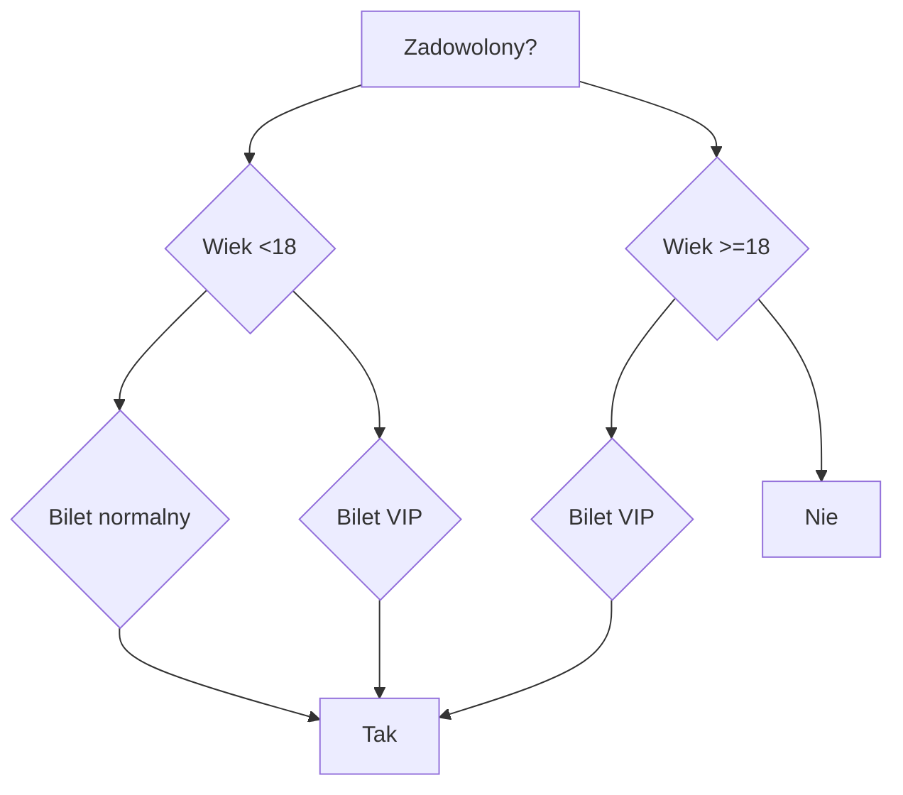

# Czym Jest Model AI: Techniczne Wprowadzenie

## Wprowadzenie

Sztuczna inteligencja (AI) to dziedzina technologii, która prężnie się rozwija, wprowadzając innowacje i zmieniając nasz sposób życia. Centralnym elementem AI są modele, które umożliwiają komputerom naukę i adaptację. W tym artykule skupimy się na technicznych aspektach modeli AI, aby lepiej zrozumieć, jak działają i co je napędza.

## Podstawy Modeli AI

### Definicja Modelu AI

Model AI to zestaw algorytmów i struktur matematycznych zaprojektowanych do rozwiązywania określonych problemów. Modele te uczą się z danych, dostosowując swoje parametry, aby minimalizować błędy i maksymalizować dokładność predykcji.

### Rodzaje Modeli AI

#### Modele Uczenia Maszynowego (Machine Learning)

Uczenie maszynowe to podzbiór AI, który polega na tym, że komputery uczą się na podstawie danych bez wyraźnego programowania. Modele uczenia maszynowego obejmują:

- **Regresję Liniową:** Model statystyczny używany do przewidywania wartości liczbowych na podstawie zależności liniowych między zmiennymi.

  Przykład: Przewidywanie ceny domu na podstawie jego powierzchni. Jeśli mamy dane historyczne, które pokazują zależność między powierzchnią a ceną domu, możemy użyć regresji liniowej, aby przewidzieć cenę nowego domu na podstawie jego powierzchni.

- **Drzewa Decyzyjne:** Struktura przypominająca drzewo, gdzie każdy węzeł reprezentuje decyzję lub rozgałęzienie, a liście końcowe to przewidywania.

  Przykład: Przewidywanie zadowolenia odwiedzających park rozrywki na podstawie ich wieku, rodzaju biletu i liczby odwiedzonych atrakcji.

- **Sieci Neuronowe:** Modele inspirowane strukturą ludzkiego mózgu, które składają się z warstw neuronów (węzłów) połączonych wagami.

  Przykład: Rozpoznawanie pisma ręcznego. Sieci neuronowe mogą analizować obrazy liter i przewidywać, jaka litera została napisana.

- **K-Nearest Neighbors (KNN):** Model klasyfikacyjny, który przypisuje klasy na podstawie odległości do najbliższych sąsiadów w przestrzeni cech.

  Przykład: Klasyfikacja kwiatów na podstawie długości i szerokości płatków. KNN może porównywać nowe próbki do znanych przykładów i przypisywać je do odpowiednich kategorii.

- **Support Vector Machines (SVM):** Model klasyfikacyjny, który szuka optymalnej granicy decyzji, maksymalizując odległość między różnymi klasami.

  Przykład: Klasyfikacja wiadomości e-mail jako spam lub nie-spam. SVM może analizować cechy wiadomości i określać, czy jest to spam.

#### Modele Uczenia Głębokiego (Deep Learning)

Uczenie głębokie to zaawansowana forma uczenia maszynowego, wykorzystująca wielowarstwowe sieci neuronowe:

- **Konwolucyjne Sieci Neuronowe (CNN):** Szczególnie skuteczne w analizie obrazów. Używają warstw konwolucyjnych do automatycznego wykrywania cech w danych wejściowych.

  Przykład: Rozpoznawanie obiektów na zdjęciach, takich jak samochody czy piesi na ulicach.

- **Rekurencyjne Sieci Neuronowe (RNN):** Używane do analizy sekwencji danych, takich jak teksty czy sygnały czasowe. Potrafią zapamiętywać informacje o wcześniejszych elementach sekwencji, co pozwala na lepsze zrozumienie kontekstu.

  Przykład: Tłumaczenie maszynowe, gdzie RNN analizują sekwencje słów i tłumaczą tekst na inny język.

- **Autoenkodery:** Modele używane do redukcji wymiarów i ekstrakcji cech. Są przydatne w zadaniach takich jak kompresja danych i wykrywanie anomalii.

  Przykład: Kompresja obrazów, gdzie autoenkoder redukuje wymiar danych wejściowych i odtwarza je w zredukowanej formie.

- **Generative Adversarial Networks (GANs):** Modele składające się z dwóch sieci neuronowych (generatora i dyskryminatora), które współpracują, aby generować realistyczne dane, takie jak obrazy lub teksty.

  Przykład: Generowanie realistycznych zdjęć osób, które nie istnieją, na podstawie losowych wektorów.

### Kluczowe Elementy Techniczne

#### Warstwy Neuronowe

W modelach AI warstwy neuronowe są podstawowymi jednostkami przetwarzania. Każda warstwa składa się z neuronów, które wykonują obliczenia na podstawie wag i funkcji aktywacji. Warstwy można podzielić na:

- **Warstwy wejściowe:** Odbierają dane wejściowe.
- **Warstwy ukryte:** Przetwarzają dane, wykonując złożone obliczenia.
- **Warstwy wyjściowe:** Generują ostateczne wyniki lub przewidywania.
- **Warstwy konwolucyjne:** Szczególnie ważne w CNN, pomagają w wykrywaniu lokalnych wzorców w danych, takich jak krawędzie w obrazach.
- **Warstwy normalizacyjne:** Pomagają w stabilizacji i przyspieszeniu treningu sieci neuronowych poprzez normalizację danych wejściowych.

#### Funkcje Aktywacji

Funkcje aktywacji decydują o tym, które neurony zostaną "uaktywnione" i przekazują swoje sygnały do następnej warstwy. Popularne funkcje aktywacji to:

- **ReLU (Rectified Linear Unit):** $f(x) = \max(0, x)$
- **Leaky ReLU:** Modyfikacja ReLU, która pozwala na przepływ niewielkiej ilości sygnału również dla ujemnych wartości wejściowych.
- **Sigmoid:** $f(x) = \frac{1}{1 + e^{-x}}$
- **Tanh (Hyperbolic Tangent):** $f(x) = \tanh(x)$
- **Swish:** $f(x) = x \cdot \text{sigmoid}(x)$, funkcja zaproponowana przez Google, która może poprawić wyniki sieci neuronowych.

#### Optymalizacja i Funkcje Straty

Optymalizacja to proces dostosowywania wag w sieci neuronowej, aby minimalizować funkcję straty (loss function). Popularne algorytmy optymalizacji to:

- **Gradient Descent:** Algorytm iteracyjny, który aktualizuje wagi w kierunku przeciwnym do gradientu funkcji straty.
- **RMSProp:** Algorytm optymalizacji, który adaptacyjnie dobiera kroki uczenia, co może poprawić stabilność i szybkość konwergencji.
- **Adam (Adaptive Moment Estimation):** Zaawansowany algorytm optymalizacji, który łączy zalety Adagrad i RMSProp.

#### Regularyzacja

Regularyzacja pomaga zapobiegać przetrenowaniu modelu, dodając karę za złożoność modelu do funkcji straty. Popularne techniki regularizacji to:

- **L2 Regularization:** Dodaje sumę kwadratów wag do funkcji straty.
- **Dropout:** Losowo wyłącza neurony podczas treningu, co zmusza sieć do bardziej odpornego uczenia.
- **Early Stopping:** Technika polegająca na przerywaniu treningu, gdy wydajność na zbiorze walidacyjnym przestaje się poprawiać, aby uniknąć przetrenowania.

## Proces Trenowania Modelu AI

### Zbieranie i Przygotowanie Danych

Dane są podstawą modelu AI. Proces ten obejmuje:

- **Zbieranie:** Gromadzenie odpowiednich danych z różnych źródeł.
- **Czyszczenie:** Usuwanie brakujących wartości, korekcja błędów.
- **Normalizacja:** Skalowanie danych, aby wszystkie miały podobny zakres wartości.
- **Augmentacja Danych:** Zwiększanie różnorodności danych treningowych poprzez techniki takie jak obracanie, skalowanie czy zmienianie jasności obrazów.

### Trenowanie Modelu

Trenowanie modelu polega na dostosowywaniu wag w sieci neuronowej za pomocą algorytmów optymalizacji. Proces ten obejmuje:

- **Forward Propagation:** Przekazywanie danych wejściowych przez warstwy sieci, aby uzyskać prognozy.
- **Backward Prop

agation:** Obliczanie gradientów i aktualizacja wag w celu minimalizacji funkcji straty.

### Walidacja i Testowanie

Walidacja i testowanie mają na celu ocenę wydajności modelu na niewidzianych danych. Proces ten obejmuje:

- **Walidacja Krzyżowa:** Podział danych na k części, gdzie każda część jest używana jako zestaw walidacyjny, a pozostałe jako treningowe.
- **Testowanie:** Ocena modelu na zestawie testowym, aby sprawdzić jego ogólną wydajność.
- **Walidacja k-krotna (k-fold cross-validation):** Technika, która polega na podzieleniu danych na k części, gdzie każda część jest używana jako zestaw walidacyjny, a pozostałe jako treningowe, co pomaga w bardziej rzetelnej ocenie wydajności modelu.

### Wdrożenie

Po zakończeniu trenowania i testowania model jest wdrażany do rzeczywistych zastosowań, takich jak systemy rekomendacji, chatboty czy analizy danych.

## Zastosowania Modeli AI

Modele AI znajdują zastosowanie w wielu dziedzinach:

- **Analiza Tekstu i Języka:** Narzędzia do tłumaczenia, analizy sentymentu i generowania tekstu.
- **Rozpoznawanie Obrazów:** Diagnostyka medyczna, systemy monitoringu i autonomiczne pojazdy.
- **Przetwarzanie Mowy:** Asystenci głosowi, transkrypcje i tłumaczenia w czasie rzeczywistym.
- **Systemy Rekomendacji:** Personalizowane rekomendacje produktów, filmów i muzyki.
- **Finanse:** Modele AI są używane do prognozowania rynków finansowych, wykrywania oszustw i zarządzania ryzykiem.
- **Medycyna:** AI pomaga w diagnozowaniu chorób, analizie obrazów medycznych oraz personalizowanej opiece zdrowotnej.
- **Logistyka:** Optymalizacja tras dostaw, zarządzanie magazynami i prognozowanie zapotrzebowania.

## Przykłady

### Przykład Zastosowania Regresji Liniowej

**Regresja Liniowa:** Model statystyczny używany do przewidywania wartości liczbowych na podstawie zależności liniowych między zmiennymi.

#### Przykład

Wyobraź sobie, że jesteś właścicielem sklepu internetowego i chcesz przewidzieć miesięczne przychody na podstawie liczby odwiedzin na stronie. Masz dane historyczne dotyczące liczby odwiedzin i przychodów za ostatnie miesiące. Możesz użyć regresji liniowej, aby znaleźć zależność między liczbą odwiedzin a przychodami.

Przykładowe dane:

- Miesiąc 1: 10 000 odwiedzin, przychód 50 000 zł
- Miesiąc 2: 15 000 odwiedzin, przychód 75 000 zł
- Miesiąc 3: 20 000 odwiedzin, przychód 100 000 zł

Model regresji liniowej może wyznaczyć liniową zależność: przychód = 5 *liczba odwiedzin. Na podstawie tej zależności można przewidzieć, że jeśli w następnym miesiącu liczba odwiedzin wyniesie 18 000, to przychód będzie wynosił 90 000 zł (18 000 odwiedzin* 5 zł/odwiedzinę).

### Przykład Zastosowania Drzewa Decyzyjnego

**Drzewa Decyzyjne:** Struktura przypominająca drzewo, gdzie każdy węzeł reprezentuje decyzję lub rozgałęzienie, a liście końcowe to przewidywania.

#### Przykład

Wyobraź sobie, że jesteś właścicielem parku rozrywki i chcesz przewidzieć, czy odwiedzający będą zadowoleni na podstawie różnych czynników, takich jak wiek, rodzaj biletu i liczba odwiedzonych atrakcji. Możesz użyć drzewa decyzyjnego, aby stworzyć model predykcyjny.

Przykładowe dane:

- **Wiek:** <18, 18-30, >30
- **Rodzaj biletu:** normalny, VIP
- **Liczba odwiedzonych atrakcji:** 1-5, 6-10, >10

#### Założenia Drzewa Decyzyjnego: Kiedy Osoby Są Zadowolone?

1. **Wiek < 18 lat:**
   - **Bilet normalny:** Osoby są zadowolone niezależnie od liczby odwiedzonych atrakcji.
   - **Bilet VIP:** Osoby są zadowolone niezależnie od liczby odwiedzonych atrakcji.

2. **Wiek >= 18 lat:**
   - **Bilet VIP:** Osoby są zadowolone niezależnie od liczby odwiedzonych atrakcji.
   - **Bilet normalny:** Osoby są niezadowolone niezależnie od liczby odwiedzonych atrakcji.

#### Przykładowe Drzewo Decyzyjne w Mermaid

### Przykład

1. **Osoba 1:** Wiek <18, bilet normalny, odwiedziła 8 atrakcji -> przewidywanie: Tak (zadowolony)
2. **Osoba 2:** Wiek >=18, bilet VIP, odwiedziła 6 atrakcji -> przewidywanie: Tak (zadowolony)
3. **Osoba 3:** Wiek >=18, bilet normalny, odwiedziła 4 atrakcje -> przewidywanie: Nie (niezadowolony)
4. **Osoba 4:** Wiek >=18, bilet VIP, odwiedziła 12 atrakcji -> przewidywanie: Tak (zadowolony)

## Rzeczywiste Zastosowania

Drzewa decyzyjne są używane w wielu rzeczywistych zastosowaniach:

- **Medycyna:** Diagnozowanie chorób na podstawie objawów pacjentów.
- **Finanse:** Ocena ryzyka kredytowego na podstawie historii kredytowej.
- **Marketing:** Segmentacja klientów na podstawie ich zachowań zakupowych.

## Podsumowanie

Modele AI są fundamentem współczesnej sztucznej inteligencji, pozwalając komputerom na naukę, adaptację i wykonywanie złożonych zadań. Dzięki zaawansowanym technikom, takim jak sieci neuronowe, optymalizacja i regularyzacja, modele te znajdują zastosowanie w szerokim zakresie dziedzin, od analizy tekstu po rozpoznawanie obrazów i przetwarzanie mowy. Zrozumienie technicznych aspektów modeli AI jest kluczowe dla pełnego wykorzystania ich potencjału i dalszego rozwoju tej ekscytującej dziedziny.
