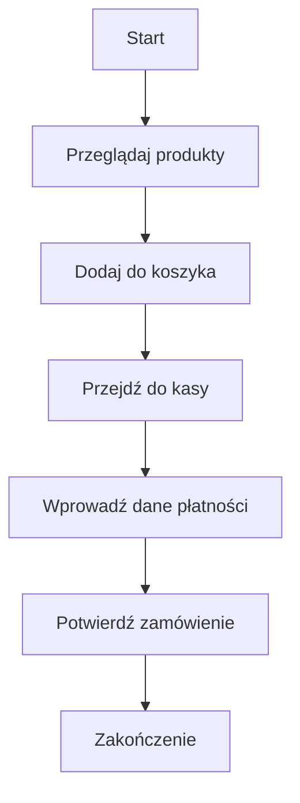
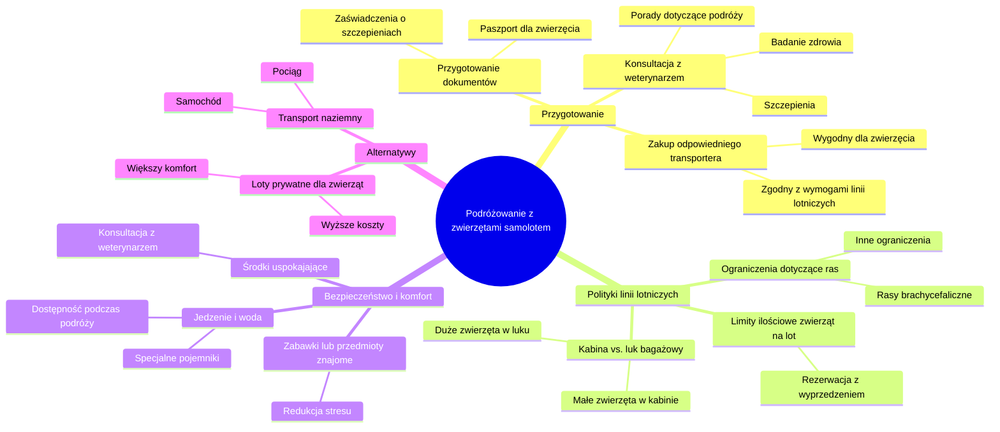

# Mapy myśli

## Jak działają mapy myśli?

Mapy myśli, znane również jako mapy konceptualne lub mind mapping, to graficzne narzędzie organizacyjne, które pomaga wizualizować informacje i ich wzajemne powiązania. Są one szczególnie przydatne do planowania, uczenia się, rozwiązywania problemów i twórczego myślenia. Oto kluczowe elementy i kroki związane z tworzeniem map myśli:

## Kluczowe Elementy Map Myśli

1. **Centralna Idea**:
   - W centrum mapy myśli umieszczasz główną ideę lub temat, od którego wszystko się zaczyna. Może to być słowo, obrazek lub symbol.

2. **Gałęzie**:
   - Od centralnej idei wychodzą gałęzie reprezentujące główne kategorie lub podtematy. Każda gałąź zawiera kluczowe słowo lub frazę, które rozwijają główną ideę.

3. **Podgałęzie**:
   - Z głównych gałęzi wychodzą kolejne, bardziej szczegółowe gałęzie. Każda z nich rozwija myśl zawartą w głównej gałęzi, dostarczając dodatkowych informacji i szczegółów.

4. **Kolory i Obrazy**:
   - Kolory, obrazy i symbole są używane do lepszego zrozumienia i zapamiętania informacji. Pomagają one również w rozróżnieniu różnych części mapy i tworzeniu powiązań między nimi.

5. **Linie i Połączenia**:
   - Linie łączące gałęzie pomagają zrozumieć relacje między różnymi elementami mapy. Mogą być proste, zakrzywione lub ozdobione strzałkami.

## Kroki Tworzenia Mapy Myśli

1. **Rozpocznij od Centralnej Idei**:
   - Narysuj lub zapisz główną ideę w centrum strony. Może to być obrazek, słowo lub symbol, który najlepiej reprezentuje temat.

2. **Dodaj Główne Gałęzie**:
   - Wokół centralnej idei narysuj kilka głównych gałęzi, które reprezentują kluczowe kategorie lub podtematy. Na końcu każdej gałęzi zapisz kluczowe słowo lub frazę.

3. **Rozwijaj Podgałęzie**:
   - Z każdej głównej gałęzi wychodzą podgałęzie, które rozwijają daną kategorię. Dodaj więcej szczegółów i informacji, tworząc kolejne poziomy gałęzi.

4. **Użyj Kolorów i Obrazów**:
   - Dodaj kolory, obrazy i symbole, aby ułatwić zrozumienie i zapamiętanie informacji. Każda kategoria może być oznaczona innym kolorem.

5. **Łącz Elementy**:
   - Dodaj linie i połączenia między różnymi gałęziami, aby pokazać powiązania i relacje między nimi.

## Zalety Map Myśli

- **Lepsze Zapamiętywanie**: Dzięki wizualnemu formatowi i użyciu kolorów oraz obrazów mapy myśli pomagają lepiej zapamiętywać informacje.
- **Kreatywność**: Umożliwiają swobodne i nieliniowe myślenie, co sprzyja twórczości.
- **Organizacja**: Pomagają w przejrzystym i logicznym organizowaniu myśli oraz informacji.
- **Efektywność Nauki**: Ułatwiają szybkie przyswajanie i przetwarzanie dużej ilości informacji.

## Przykłady Zastosowania

1. **Nauka i Przypominanie Sobie Informacji**:
   - Mapy myśli mogą być używane do nauki nowych tematów, tworzenia notatek oraz przygotowywania się do egzaminów.

2. **Planowanie Projektów**:
   - Pomagają w organizacji zadań, planowaniu etapów projektu oraz zarządzaniu czasem.

3. **Rozwiązywanie Problemów**:
   - Ułatwiają analizę problemów, identyfikację przyczyn oraz generowanie rozwiązań.

4. **Burza Mózgów**:
   - Wspomagają proces generowania pomysłów i rozwijania koncepcji podczas sesji burzy mózgów.

## Przykład Mapy Myśli

[Przykład mapy myśli](https://upload.wikimedia.org/wikipedia/commons/thumb/6/64/MindMapGuidlines.svg/1024px-MindMapGuidlines.svg.png)
*Źródło: Wikimedia Commons*

Mapy myśli są wszechstronnym narzędziem, które można dostosować do wielu różnych zastosowań, od osobistego rozwoju po profesjonalne zarządzanie projektami. Spróbuj stworzyć własną mapę myśli i przekonaj się, jak może poprawić Twoją produktywność i kreatywność!

## Mapa myśli: Instalacja Pythona i PyCharm

[View or edit this diagram in Whimsical.](https://whimsical.com/instalacja-pythona-i-pycharm-XE2nCPr5uNuZjTCpD38Zwx?ref=chatgpt)

