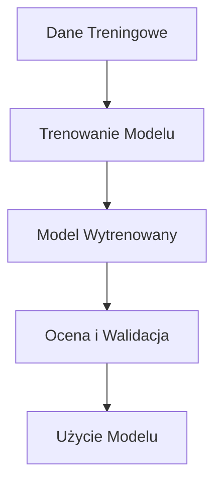

# Model AI w kontekście Prompt Engineering

## Co to jest model AI?

Model AI (Artificial Intelligence) to system komputerowy zaprojektowany do wykonywania zadań, które zazwyczaj wymagają ludzkiej inteligencji. Modele AI mogą przetwarzać dane, rozpoznawać wzorce, podejmować decyzje, a nawet przewidywać przyszłe zdarzenia na podstawie dostarczonych danych.

## Główne komponenty modelu AI

1. **Dane treningowe**: Surowe informacje, które są wykorzystywane do trenowania modelu. Im więcej i lepszej jakości dane, tym dokładniejszy model.
2. **Algorytm**: Zbiór reguł lub procedur, które model wykorzystuje do analizy danych i uczenia się.
3. **Model wytrenowany**: Wynik procesu treningowego, który można wykorzystać do przewidywania lub klasyfikacji nowych danych.
4. **Ocena i walidacja**: Proces sprawdzania, jak dobrze model radzi sobie z zadaniami na zestawach danych testowych, które nie były używane podczas treningu.

## Typy modeli AI

1. **Modele nadzorowane (supervised learning)**: Uczą się na oznaczonych danych, gdzie każdy przykład treningowy jest sparowany z odpowiednią odpowiedzią.
2. **Modele nienadzorowane (unsupervised learning)**: Uczą się na nieoznaczonych danych, gdzie system próbuje znaleźć ukryte wzorce bez dostarczonych odpowiedzi.
3. **Modele pół-nadzorowane (semi-supervised learning)**: Uczą się na mieszance oznaczonych i nieoznaczonych danych.
4. **Modele wzmacniające (reinforcement learning)**: Uczą się na podstawie interakcji z otoczeniem, gdzie otrzymują nagrody lub kary za swoje akcje.

## Prompt Engineering

Prompt Engineering to sztuka tworzenia i dostosowywania zapytań (promptów), które kierują modelem AI do wygenerowania pożądanych wyników. Jest to szczególnie ważne w pracy z modelami językowymi, takimi jak GPT-4.

## Jak efektywnie tworzyć prompty?

1. **Zrozumienie modelu**: Wiedza o tym, jak model działa i jakie dane zostały użyte do jego treningu.
2. **Jasność i precyzja**: Formułowanie promptów w sposób jasny, konkretny i jednoznaczny.
3. **Kontekst**: Dostarczanie odpowiedniego kontekstu, aby model mógł lepiej zrozumieć zapytanie.
4. **Iteracja i testowanie**: Eksperymentowanie z różnymi promptami i iteracyjne doskonalenie ich na podstawie wyników.

## Przykład zastosowania Prompt Engineering

Załóżmy, że mamy model językowy i chcemy uzyskać od niego opis czegoś w prosty sposób:

```markdown
## Prompt:
Opisz model AI w kontekście nauki do pozostania Prompt Engineering.

## Odpowiedź:
Model AI (Artificial Intelligence) to system komputerowy zaprojektowany do wykonywania zadań, które zazwyczaj wymagają ludzkiej inteligencji. Modele AI mogą przetwarzać dane, rozpoznawać wzorce, podejmować decyzje, a nawet przewidywać przyszłe zdarzenia na podstawie dostarczonych danych. Prompt Engineering to sztuka tworzenia i dostosowywania zapytań (promptów), które kierują modelem AI do wygenerowania pożądanych wyników.
```

## Diagram Mermaid

Aby zilustrować proces działania modelu AI, możemy użyć diagramu Mermaid:



Ten diagram pokazuje podstawowe etapy tworzenia i używania modelu AI.

## Podsumowanie

Model AI jest kluczowym narzędziem w dzisiejszej technologii, zdolnym do wykonywania zadań wymagających inteligencji. Prompt Engineering, czyli sztuka tworzenia efektywnych zapytań do modeli AI, jest niezwykle ważna dla uzyskiwania pożądanych wyników i maksymalizowania użyteczności tych modeli.
